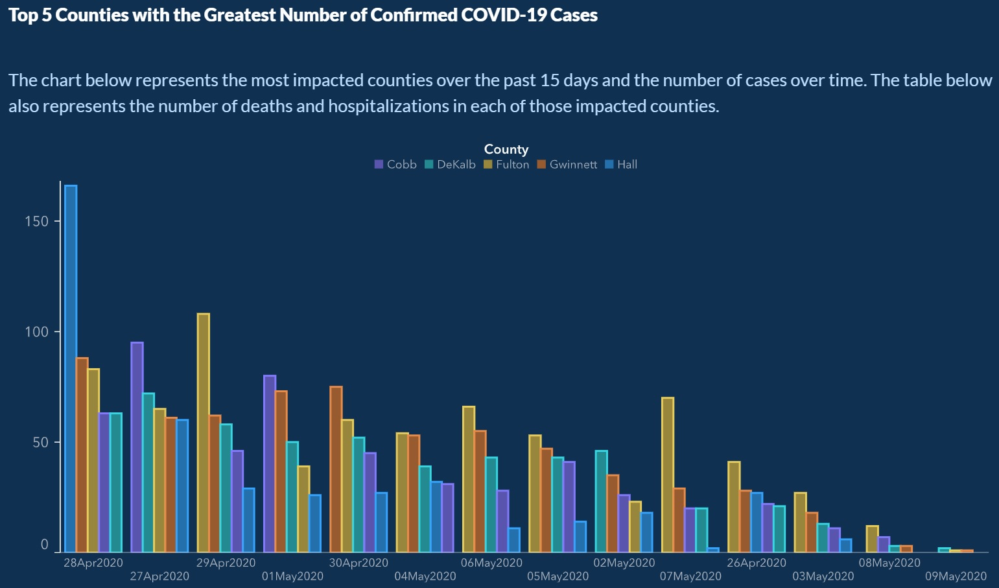
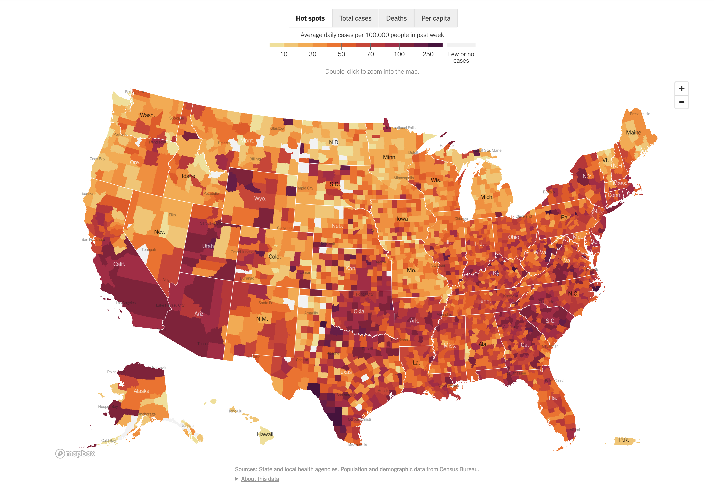

#### Backgrounds of the Project

In May 2020, the Georgia Department of Public Health posted the following plot to illustrate the number of confirmed COVID-19 cases in their hardest-hit counties over a two-week period. Health officials claimed that the plot provided evidence that COVID-19 cases were decreasing and made the argument for reopening the state.

{ width=75% }

The plot was heavily criticized by the statistical community and several media outlets for its deceptive portrayal of COVID-19 trends in Georgia. Whether the end result was due to malicious intent or simply poor judgment, it is incredibly irresponsible to publish data visualizations that obscure and distort the truth. 

Data visualization is an incredibly powerful tool that can affect health policy decisions. Ensuring they are easy to interpret, and more importantly, showcase accurate insights from data is paramount for scientific transparency and the health of individuals.

#### Targets of the Project

For this assignment, I am going to reproduce COVID-19 visualizations and tables published by the [New York Times](https://www.nytimes.com/interactive/2020/us/coronavirus-us-cases.html).

The tasks for the final project includes reproducing the following plots and tables:

1. New cases as a function of time with a rolling average plot - the first plot on the page (you don't need to recreate the colors or theme)
2. Table of cases, hospitalizations and deaths - the first table on the page
3. The county-level map for previous week ('Hot spots') - the second plot on the page (only the 'Hot Spots' plot)
4. Table of cases by state - the second table on the page (do not need to include per 100,000 or per capita columns)

Data for cases and deaths are downloaded from the website [NYT GitHub repository](https://github.com/nytimes/covid-19-data) (use `us-counties.csv`). Data for hospitalizations would be downloaded from [The COVID Tracking Project](https://covidtracking.com/data). 

The project is completed in a RMarkdown file with knitted PDF. The project documents would be uploaded to a GitHub repository created within the [reproducible data science organization](https://github.com/reproducibleresearch). A brief README file would also be constructed and commited to the GitHub Repository.

#### Preparation on New Data and Packages

Some important packages would be loaded in advance. They may not all be applied but I would like to put them here.

```{r, warning=FALSE, echo=FALSE, message=FALSE}
# Load libraries
library(ggplot2)
library(tidyverse)
library(stringr)
library(zoo)
library(lubridate)
library(kableExtra)
library(formattable)
library(sparkline)
library(magick)
library(urbnmapr)
library(urbnthemes)
sparkline(0)
```

And the .csv files I downloaded from their official datasets could be read in the following way. The population dataset is the newest here, and I would use the 2019 estimate data and see if that would work as expected.

```{r}
history_raw <- read_csv("national-history.csv")
uscounties_raw <- read_csv("us-counties.csv")
population_raw <- read_csv("co-est2019-alldata.csv")
```

All the following datasets would be applied till the day 01/17/2021. The data would start in the very beginning of the pandemic.

For the dataset downloaded from the COVID Tracking Project, I would only use the data for hospitalization. To be specific, the current number of hospitalization for each day.

```{r}
history <- history_raw[,c(1, 7)]
head(history, 6)
```

For the dataset downloaded from NYTimes GitHub Repo, we notice that they would involve every county in the united states, and shall include all counties that they have data on. We would like to grab the new case and death data from there.

```{r}
head(uscounties_raw, 6)
```

We could see here that the county-level are arranged in time order, and county names are mentioned simultaneously. A convenient way is to arrange the time and calculate the summation of total cases by time. This could be a bit tedious but shall be necessary if we would need to get the right answer.

Finally, we have got the population data from the US Census Bureau. We have a large dataset here but we would only need a part of it, namely, the (estimated) population by county in the year 2019, which is the best official estimate we could get.

```{r}
population <- population_raw[,c(4,5,6,7,19)]
head(population, 6)
```

The "key" to link this to the COVID dataset, the FIPS code, is a combination of the State code and County code given above. So now we have pretty much everything we need to get the data prepared for further research.

### Task 1: New cases as a function of time with a rolling average plot 

The "sample answer" to Task 1 and Task 2 are given in the following figure.

{ width=75% }

Here we start from, say March 1, and keep recording the number until we reach the date of 01/17/2021. One intuitive way to get the job done is to count the total numbers of the patients from each day in all the counties available. 

We need to create a dataset for the daily number of patients. The `lubridate` package could be very useful. There has been 363 days from the beginning of the first COVID case in the US to the nearest date we want to reproduce. (It is pretty surprising foe me since I thought all things happen in a sudden) So we could play the following trick to calculate the daily number of patients and deaths.

Since we are working with "new cases" and "new deaths", we could consider doing some brief adjustment to the data.

Notice that we have no "death" records for the data in Puerto Rico, yet these data would need to be removed. Since "missing is missing", it will be good if NYTimes could explain this in advance. Their cases count matches with the data including Puerto Rico, but for the deaths data they did not include Puerto Rico. 

```{r}
time <- seq(0, 362)
time_ymd <- ymd(20200121) + time
cases <- rep(0, length(time_ymd))
death <- rep(0, length(time_ymd))
for(i in 1:length(time_ymd)){
  data_temp <- uscounties_raw[uscounties_raw$date == time_ymd[i],]
  cases[i] <- sum(data_temp$cases)
  death[i] <- sum(data_temp$deaths, na.rm = TRUE)
}

## Calculate the difference
new_cases <- rep(0, length(time_ymd))
new_death <- rep(0, length(time_ymd))
for (i in 1:length(time_ymd)){
  if (i == 1){
    new_cases[i] <- cases[i]
    new_death[i] <- death[i]
  }
  else{
    new_cases[i] <- cases[i] - cases[i - 1]
    new_death[i] <- death[i] - death[i - 1]
  }
}
```

I may not be able to obtain exactly the same theme and all the features as the NYTimes plot, but obviously, the shape and general patterns of the plot has been reproduced as expected. We could see that the data is given for every single day. we could consider adding the 7 day average data, and see how the average curve would behave.

It is fair enough to set `align = "right"` when we play with the `zoo` package, which would make much more sense.

```{r}
new_cases_7dayavg <- rollmean(new_cases, k = 7, align = "right", fill = NA)
new_death_7dayavg <- rollmean(new_death, k = 7, align = "right", fill = NA)
```

Finally, we could assemble the contents given above, and generate our "final" dataset. 

```{r}
dat_Q1 <- cbind(time_ymd) %>% as.data.frame()
dat_Q1$new_cases <- new_cases
dat_Q1$new_death <- new_death
dat_Q1$new_cases_7dayavg <- new_cases_7dayavg
dat_Q1$new_death_7dayavg <- new_death_7dayavg
dat_Q1$calendar <- as_date(time_ymd)
dat_Q1 <- dat_Q1[dat_Q1$time_ymd >= 18322,]
```

This dataset shall be ready for reproduction. Plotting would be made easy through `ggplot2`. I believe that the following reproduced plot would be good enough.

```{r}
png(filename="reproduced_nyt1.png", width=3600, height=1800, res = 300)

ggplot(data = dat_Q1) +
  geom_col(aes(x = time_ymd, y = new_cases), 
           color = "#F9766D", fill = "#F8766D", alpha = 0.5) +
  geom_line(aes(x = time_ymd, y = new_cases_7dayavg), 
            color = "#D11141", size = 1.1) +
  geom_text(x = 18462, y = 100000, 
            label = "7-day average curve", 
            color = "#D11141", size = 5) +
  geom_text(x = 18462, y = 82500, label = "|", 
            color = "#D11141", size = 5) +
  geom_text(x = 18585, y = 280000, label = "New cases -", 
            color = "#F8766D", size = 5) +
  scale_y_continuous(breaks = seq(0, 300000, 100000), 
                     labels = c("0", "100,000", 
                                "200,000", "300,000 cases")) +
  scale_x_continuous(
    breaks = c(18322, 18353, 18383, 18414, 18444,
               18475, 18506, 18536, 18567, 18597, 18628), 
    labels = c("Mar. 2020", "Apr.", "May", "Jun.", "Jul.", 
               "Aug.", "Sept.", "Oct.", "Nov.", "Dec.", "Jan. 2021")) +
  labs(title = "Coronavirus in the US.: Latest Map and Case Count", 
       subtitle = "Updated January 17, 2021", x = "", y = "") +
  theme_bw() +
  theme(plot.title = element_text(size = 25, face = "bold", 
                                  hjust = 0.5), 
        plot.subtitle = element_text(size = 10, 
                                     color = "#D11141", hjust = 0.5), 
        panel.border = element_blank(), panel.grid.minor = element_blank(), 
        panel.grid.major.x = element_blank())

dev.off()
```

The reproduced plot is given in `reproduced_nyt1.png`. The same plot could be given in the R Markdown file as well. The following plot may not look exactly the same as the original plot, but shall contain all the key elements we supposed to see.

```{r}
ggplot(data = dat_Q1) +
  geom_col(aes(x = time_ymd, y = new_cases), 
           color = "#F9766D", fill = "#F8766D", alpha = 0.5) +
  geom_line(aes(x = time_ymd, 
                y = new_cases_7dayavg), 
            color = "#D11141", size = 1.1) +
  geom_text(x = 18462, y = 100000, 
            label = "7-day average curve", 
            color = "#D11141", size = 5) +
  geom_text(x = 18462, y = 82500, 
            label = "|", 
            color = "#D11141", size = 5) +
  geom_text(x = 18585, y = 280000, 
            label = "New cases -", 
            color = "#F8766D", size = 5) +
  scale_y_continuous(breaks = seq(0, 300000, 100000), 
                     labels = c("0", "100,000", "200,000", 
                                "300,000 cases")) +
  scale_x_continuous(breaks = c(18322, 18353, 18383, 18414, 
                                18444, 18475, 18506, 18536, 
                                18567, 18597, 18628), 
                     labels = c("Mar. 2020", "Apr.", "May", 
                                "Jun.", "Jul.", "Aug.", "Sept.", 
                                "Oct.", "Nov.", "Dec.", "Jan. 2021")) +
  labs(title = "Coronavirus in the US.: Latest Map and Case Count", 
       subtitle = "Updated January 17, 2021", x = "", y = "") +
  theme_bw() +
  theme(plot.title = element_text(size = 15, face = "bold", 
                                  hjust = 0.5), 
        plot.subtitle = element_text(size = 10, color = "#D11141", 
                                     hjust = 0.5), 
        panel.border = element_blank(), panel.grid.minor = element_blank(), 
        panel.grid.major.x = element_blank())
```

Furthermore, we could do the same thing for death count, just keep in mind that the death count does not include Puerto Rico.

```{r, eval = FALSE}
png(filename="reproduced_nyt1_deaths.png", width=3600, height=1800, res = 300)

ggplot(data = dat_Q1) +
  geom_col(aes(x = time_ymd, y = new_death), color = "#808080", 
           fill = "#bfbfbf", alpha = 0.5) +
  geom_line(aes(x = time_ymd, y = new_death_7dayavg), 
            color = "#404040", size = 1.1) +
  geom_text(x = 18538, y = 1400, 
            label = "7-day average curve", 
            color = "#404040", size = 5) +
  geom_text(x = 18538, y = 1225, label = "|", 
            color = "#404040", size = 5) +
  geom_text(x = 18600, y = 3800, label = "New deaths -", 
            color = "#808080", size = 5) +
  scale_y_continuous(breaks = seq(0, 4000, 2000), 
                     labels = c("0", "2,000", "4,000 deaths")) +
  scale_x_continuous(breaks = c(18322, 18353, 18383, 
                                18414, 18444, 18475, 
                                18506, 18536, 18567, 
                                18597, 18628), 
                     labels = c("Mar. 2020", "Apr.", 
                                "May", "Jun.", "Jul.", 
                                "Aug.", "Sept.", "Oct.", 
                                "Nov.", "Dec.", "Jan. 2021")) +
  labs(title = "New Reported Deaths by Day", 
       subtitle = "Updated January 17, 2021", x = "", y = "") +
  theme_bw() +
  theme(plot.title = element_text(size = 25, face = "bold", 
                                  hjust = 0.5), 
        plot.subtitle = element_text(size = 10, color = "#D11141", 
                                     hjust = 0.5), 
        panel.border = element_blank(), 
        panel.grid.minor = element_blank(), 
        panel.grid.major.x = element_blank())

dev.off()
```

```{r}
ggplot(data = dat_Q1) +
  geom_col(aes(x = time_ymd, y = new_death), 
           color = "#808080", 
           fill = "#bfbfbf", alpha = 0.5) +
  geom_line(aes(x = time_ymd, y = new_death_7dayavg), 
            color = "#404040", size = 1.1) +
  # geom_text(x = 18538, y = 1400, 
  # label = "7-day average curve", color = "gray25", size = 5) +
  # geom_text(x = 18538, y = 1225, 
  # label = "|", color = "gray25", size = 5) +
  # geom_text(x = 18600, y = 3800, 
  # label = "New deaths -", color = "gray50", size = 5) +
  scale_y_continuous(breaks = 
                       seq(0, 4000, 2000), 
                     labels = c("0", "2,000", "4,000 deaths")) +
  scale_x_continuous(breaks = c(18322, 18353, 18383, 
                                18414, 18444, 18475, 
                                18506, 18536, 18567, 
                                18597, 18628), 
                     labels = c("Mar. 2020", "Apr.", 
                                "May", "Jun.", "Jul.", 
                                "Aug.", "Sept.", "Oct.", 
                                "Nov.", "Dec.", "Jan. 2021")) +
  labs(title = "New Reported Deaths by Day", 
       subtitle = "Updated January 17, 2021", 
       x = "", y = "") +
  theme_bw() +
  theme(plot.title = element_text(size = 15, face = "bold", 
                                  hjust = 0.5), 
        plot.subtitle = element_text(size = 10, color = "#D11141", 
                                     hjust = 0.5), 
        panel.border = element_blank(), 
        panel.grid.minor = element_blank(), 
        panel.grid.major.x = element_blank())
```

There are several days marked in the original website as "with reporting anomaly". But we are not having such data of "days with reporting anomaly" in hand, and I would like to keep all the data available, as shown above. The plots may not exactly be the same since reproducing the theme could be difficult, but they are similar enough and we could consider that the reproducibility of Plot 1 is fairly high.

### Task 2: The table of cases, hospitalization and deaths

The table of cases only consider # of cases on the day of Jan. 17, 2021. We need to present cumulative cases, cumulative deaths, current case, current death, current hospitalization, and their changing trends in 14 days. 

```{r}
## Cumulative cases and deaths
cases_cumul <- sum(new_cases)
death_cumul <- sum(new_death)
cases_cumul
death_cumul
```

We have 23,983,607 cumulative COVID-19 cases, and 397,612 total reported deaths. These numbers match with the table we want to reproduce.

```{r}
## Current case and current death at Jan. 17 2021
cases_Jan17 <- new_cases[363]
death_Jan17 <- new_death[363]
cases_Jan17
death_Jan17
```

We have 169,641 cases and 1,730 deaths on Jan. 17, 2021, which matches with the table on NYTimes website.

```{r}
## Current hispitalization
hosp_Jan17 <- as.numeric(history[history$date == "2021-01-17",2])
hosp_Jan17
```

We have 124,387 people hospitalized due to COVID-19 at Jan. 17, 2021, which matches with the data given online.

And now we have reproduced all the numbers we believe to be important. Finally, we need to play with the 14-day change. As NYTimes have mentioned, we could see that the trend is checked on the basis of 7-day averages. 

```{r}
cases_14daychange <- round((dat_Q1$new_cases_7dayavg[dim(dat_Q1)[1]] 
                            / dat_Q1$new_cases_7dayavg[dim(dat_Q1)[1] - 14] - 1) 
                           * 100)
death_14daychange <- round((dat_Q1$new_death_7dayavg[dim(dat_Q1)[1]] 
                            / dat_Q1$new_death_7dayavg[dim(dat_Q1)[1] - 14] - 1) 
                           * 100)

cases_14daychange
death_14daychange
```

The 7-day averages of cases increase by 3% in the recent 14 days, and deaths increase by 26% in the recent 14 days. This result matches with the result we had on the website.

For hospitalization, we also need to consider their 7-day average trend and see how much we could do from the data we have.

```{r}
history$hosp_7dayavg <- rollmean(history$hospitalizedCurrently, 
                                 k = 7, align = "left", fill = NA)
hosp_14daychange <- round((history$hosp_7dayavg[history$date == "2021-01-17"] 
                           / history$hosp_7dayavg[history$date == "2021-01-03"] - 1) 
                          * 100)
hosp_14daychange
```

The 7-day averages of hospitalization increased by 3% in the recent 14 days, which matches with the result we had on the website. From here, we could see that all the numerical contents have been successfully reproduced, and all numbers match perfectly. This indicates that the table of cases, hospitalization and deaths based on the NYTimes data is highly reproducible.

Finally, we hash everything together and assemble result by the end of the day. To make the table look better, we shall consider using `KableExtra`. It could be difficult to reproduce everything, but the number has been alright. The output would be saved as .png files and made available online.

First, I would make a raw-data table based on what we had:

```{r}
vec_total <- c(cases_cumul, death_cumul, "")
current_total <- c(cases_Jan17, death_Jan17, hosp_Jan17)
day_change <- paste0("+", c(cases_14daychange, death_14daychange, hosp_14daychange), "%")
dat_Q2_raw <- cbind(vec_total, current_total, day_change) %>% as.data.frame()
rownames(dat_Q2_raw) <- c("Cases", "Deaths", "Hospitalized")
colnames(dat_Q2_raw) <- c("TOTAL REPORTED", "ON JAN. 17", "14-DAY CHANGE")
```

We could try to make them look similar:

```{r, eval = FALSE}
kable(dat_Q2_raw, align = "rrr") %>%
  kable_paper(full_width = F) %>%
  row_spec(0, color = "black", bold = F, font_size = 10) %>%
  row_spec(1, color = "#D11141") %>%
  row_spec(2:3, color = "black") %>%
  column_spec(1, color = "black", bold = T) %>%
  kable_styling(bootstrap_options = c("hover", "condensed", "responsive")) %>%
  save_kable("reproduced_nyt1_table_raw.png", zoom = 1.5)
```

```{r}
kable(dat_Q2_raw, align = "rrr") %>%
  kable_paper(full_width = F) %>%
  row_spec(0, color = "black", bold = F, font_size = 10) %>%
  row_spec(1, color = "#D11141") %>%
  row_spec(2:3, color = "black") %>%
  column_spec(1, color = "black", bold = T) %>%
  kable_styling(bootstrap_options = c("hover", "condensed", "responsive"))
```

And I could make the plot look more like what we had in the table. 

```{r}
dat_Q2 <- dat_Q2_raw
dat_Q2$`TOTAL REPORTED` <- c("23.9 million+", "397,612", "")
dat_Q2$`ON JAN. 17`<- c("169,641", "1,730", "124,387")
```

By the way, I would suppose that the tiny arrow sign is used to mark the trend of 14-day change on cases, deaths, and hospitalized people. I know that reproducing the tiny arrow may not be tangible, but I would use the package `sparkline` to mimic such arrows as much as possible. We need to briefly wrangle the data and see the tendence of 7-day average trend. Some other packages, such as `formattable`, would also be important to get the things done.  

```{r}
dat_7dayavg_Q2 <- 
  dat_Q1$new_cases_7dayavg[(dim(dat_Q1)[1] - 14) : dim(dat_Q1)[1]]%>% 
  as.data.frame()
dat_7dayavg_Q2$new_death_7dayavg <- 
  dat_Q1$new_death_7dayavg[(dim(dat_Q1)[1] - 14) : dim(dat_Q1)[1]]
dat_7dayavg_Q2$new_hosp_7dayavg <- history$hosp_7dayavg[17:3]
colnames(dat_7dayavg_Q2)[1] <- "new_cases_7dayavg"
```

```{r}
spark <- c(spk_chr(dat_7dayavg_Q2$new_cases_7dayavg, 
                   fillColor = F, maxSpotColor = F, 
                   lineColor = "#D11141"), 
           spk_chr(dat_7dayavg_Q2$new_death_7dayavg, 
                   fillColor = F, maxSpotColor = F, 
                   lineColor = "#000000"), 
           spk_chr(dat_7dayavg_Q2$new_hosp_7dayavg, 
                   fillColor = F, maxSpotColor = F, 
                   lineColor = "#000000"))

dat_Q2$`TREND PLOT` <- spark

#dat_7dayavg_Q2_list <- 
#list(dat_7dayavg_Q2$new_cases_7dayavg, 
#dat_7dayavg_Q2$new_death_7dayavg, 
#dat_7dayavg_Q2$new_hosp_7dayavg)
#y <- spec_plot(dat_7dayavg_Q2_list, same_lim = FALSE, 
#file_type = "pdf")

#dat_Q2$`TREND PLOT` <- c(y[[1]]$path, y[[2]]$path, y[[3]]$path)

```

The following chunk would only work when the output is .html. Please see `reproduced_nyt1_table.png` to see what the output should be.

```{r, eval = FALSE}
dat_Q2 %>% formattable::format_table(
  x = .,
  formatters = list(
    align=c("r")
  )
) %>%
  kable_paper(full_width = F) %>%
  row_spec(0, color = "black", bold = F, font_size = 10) %>%
  row_spec(1, color = "#D11141") %>%
  row_spec(2:3, color = "black") %>%
  column_spec(1, color = "black", bold = T) %>%
  kable_styling(bootstrap_options = 
                  c("hover", "condensed", "responsive")) %>%
  htmltools::HTML() %>%
  shiny::div() %>%
  sparkline::spk_add_deps() 
```

We could see that these trend patterns would match with what we have on NYTimes website. This is pretty cool. The reproduction given above shall be good enough.

### Task 3: The county-level map for previous week ('Hot spots') - the second plot on the page

This question is optional but I feel that working with it would be interesting. I have involved the data given by US Census Bureau, and consider applying the estimated population in each U.S. county.\

We hope to get something like this.

{ width=75% }

To get it done, we need to figure out the 7-day roll average # of cases for all the counties with records. It could be quite difficult since we have many, many counties here with FIPS code as the key. There are more than 3,000 counties or their equivalents.

Here we define "past week" as the data period between 2021-01-10 and 2021-01-17. There could be other definitions, but I believe this setup would generally work.

```{r}
population_counties <- 
  population[population$COUNTY != "000",]
population_counties$FIPS <- 
  paste0(population_counties$STATE, population_counties$COUNTY)
population_counties$avg <- 
  rep(NA, dim(population_counties)[1])
uscounties <- uscounties_raw

for(i in 1:dim(population_counties)[1]){
  temp_counties <- uscounties[!is.na(uscounties$fips) 
                              & uscounties$fips == 
                                population_counties$FIPS[i] 
                              & uscounties$date >= 
                                "2021-01-10" 
                              & uscounties$date <= 
                                "2021-01-17",]
  mean_cases <- sum(temp_counties[8,5] - temp_counties[1,5]) / 7
  population_counties$avg[i] <- mean_cases
}
```

In Alaska, there are several Census Areas/Boroughs with no COVID-19 cases reported.

There is one thing worth special notice: NYC is counted as a whole, but not 5 different counties, in their county-wise data. So we would need some manual adjustment for all the counties covered in NYC.

```{r}
population_counties$CASESPER100K <- 
  (population_counties$avg / 
     population_counties$POPESTIMATE2019) * 100000
```

```{r}
temp_NYC <- uscounties[uscounties$county == "New York City",]

## Average case in NYC
population_counties[population_counties$FIPS 
                    %in% c("36085", "36005", "36061", "36081", "36047"),8] <- 
  ((temp_NYC[temp_NYC$date == "2021-01-17",5] - 
       temp_NYC[temp_NYC$date == "2021-01-10",5])/7) * 
  100000 / (476143 + 1418207 + 1628706 + 2253858 + 2559903)
```

And I consider a brief truncation to make the plot look better.

```{r}
## Truncation
population_counties[is.na(population_counties$CASESPER100K), 8] <- NA
population_counties[!is.na(population_counties$CASESPER100K) 
                    & population_counties$CASESPER100K < 0, 8] <- NA
population_counties[!is.na(population_counties$CASESPER100K) 
                    & population_counties$CASESPER100K >= 100, 8] <- 100
```

Now we have FIPS aligned with new case per 100,000 people. The package `urbnmapr` could be helpful.

```{r}
dat_refined <- population_counties[,c(6,8)]
colnames(dat_refined)[1] <- "county_fips"

dat_Q3 <- left_join(dat_refined, urbnmapr::counties, by = "county_fips") 
```

There is no way that I could make the color exact, but I believe that the following one would be good enough.

```{r}
png(filename="reproduced_nyt2.png", width=3600, height=2400, res = 400)

dat_Q3 %>%
  ggplot(aes(long, lat, group = group, fill = CASESPER100K)) +
  geom_polygon(color = NA) +
  geom_polygon(data = states, mapping = aes(long, lat, group = group),
               fill = NA, color = "#000000", size = 0.1) +
  coord_map(projection = "albers", lat0 = 39, lat1 = 45) +
  scale_fill_gradient(low = "#FFF176", high = "#B50909", 
                      na.value = "white", 
                      guide = guide_colorbar(title.position = "top")) +
  theme_minimal() + 
  theme(legend.title = element_text(),
        legend.key.width = unit(.5, "in"),
        legend.position="top") +
  labs(fill = "Average daily cases per 100,000 people in past week", 
       x = "Longitude", y = "Latitude")

dev.off()
```

```{r}
dat_Q3 %>%
  ggplot(aes(long, lat, group = group, fill = CASESPER100K)) +
  geom_polygon(color = NA) +
  geom_polygon(data = states, mapping = aes(long, lat, group = group),
               fill = NA, color = "#000000", size = 0.1) +
  coord_map(projection = "albers", lat0 = 39, lat1 = 45) +
  scale_fill_gradient(low = "#FFF176", high = "#B50909", 
                      na.value = "white", 
                      guide = guide_colorbar(title.position = "top")) +
  theme_minimal() + 
  theme(legend.title = element_text(),
        legend.key.width = unit(.5, "in"),
        legend.position="top") +
  labs(fill = "Average daily cases per 100,000 people in past week", 
       x = "Longitude", y = "Latitude")
```

If we compare this result to what we had in the plot `nyt2.png`, I have to say that the plot works pretty well.

There has been slight differences between the plot shown on NYTimes and the plot given here, as they may have used the data from 2021-01-10 to 2021-01-16, or they simply update the plot weekly and they use the data quoted from literally the "Last Week". The term "past week" allows for different explanations, and the population basis we have quoted may also be different.

Given all these above, my reproduction has managed to do a good job in reproducing the heatmap. We could see from the reproduced plot that South CA, AZ, TX, OK and SC are the places with more new cases per 100K people. On the other hand, some other states, such as MN, VT, ND, NV, HI, MO, are having fewer new cases per 100K people. The package I used does not allow me to put Puerto Rico on the map, and the 50 States plus DC are all the places available on the map.

We have some places that we get different results as the NYTimes data. For example, Gratiot county, MI is marked deep red/brown in the reproduced plot above but not in the NYTimes original plot. if we take a glance at the data, we could see that

```{r}
Gratiot <- uscounties[!is.na(uscounties$fips) & uscounties$fips == "26057",]
Gratiot[291:297,]
```

We could see that over 1000 cases are added (assigned) to Gratiot county at 2021-01-14, but this update may not yet be updated on NYTimes plot, as they marked Gratiot county in a moderate color. Things would be different if we consider the "week" as 2021-01-05 to 2021-01-11.

Remark on reproducibility: It will be beneficial if they could mark the time more clearly (say, start from 2021-01-05, and end at 2021-01-11). To make things "exact", they could try making the population data available. Anyway, the data works pretty well and some difference in patterns only occur in several states (e.g., Michigan). The data is still highly reproductive.

### Task 4: Table of cases by state - the second table on the page (do not need to include per 100,000 or per capita columns)

Finally, we are moving to Task 4. We do not need to include the second, the fourth and the fifth column. The number we are going to reproduce is given below.

{ width=75% }

Here we would consider the state-wise data. We just need to play with the two columns. The first one is the total cases, and the second one is the Daily Average in last 7 days. I believe that we could work with other columns, but that was not required.

It does seem that we could sort on the following dataset, yet we could put it in alphabetical order.

```{r}
## Some trick on making it into alphabetical order
states <- as.character(sort(as.factor(unique(uscounties$state))))
length(states)
```

We shall consider the daily average in last 7 days. It would be quite convenient on adding the estimated population.

```{r}
Total_cases <- rep(NA, length(states))
Total_cases_Jan11 <- rep(NA, length(states))
for (i in 1:length(states)){
  temp_state <- uscounties[uscounties$state == states[i] 
                           & uscounties$date == "2021-01-17",]
  Total_cases[i] <- sum(temp_state$cases)
  temp_state_Jan11 <- uscounties[uscounties$state == states[i] 
                                 & uscounties$date == "2021-01-10",]
  Total_cases_Jan11[i] <- sum(temp_state_Jan11$cases)
}
```

```{r}
dat_Q4 <- states %>% as.data.frame()
dat_Q4$total <- Total_cases
dat_Q4$totalJan11 <- Total_cases_Jan11

dat_Q4$diff <- Total_cases - Total_cases_Jan11
dat_Q4$diffavg <- round(dat_Q4$diff / 7)
```

```{r}
dat_Q4_refined <- dat_Q4[,c(1,2,5)]
dat_Q4_refined$population <- rep(NA, dim(dat_Q4_refined)[1])
for (i in 1:dim(dat_Q4_refined)[1]){
  for (j in 1:dim(population)[1]){
    if (dat_Q4_refined[i,1] == population$CTYNAME[j]){
      dat_Q4_refined$population[i] <- population$POPESTIMATE2019[j]
    }
  }
}
dat_Q4_refined <- dat_Q4_refined[complete.cases(dat_Q4_refined),]
dat_Q4_refined$totalper100 <- round(dat_Q4_refined$total 
                                    /dat_Q4_refined$population * 100000)
dat_Q4_refined$last7daysper100 <- round(dat_Q4_refined$diffavg 
                                        /dat_Q4_refined$population * 100000)
```

And we get it almost perfectly. It does seem that they use the same dataset as I did for total population, and it works well.

```{r}
data_Q4_final <- dat_Q4_refined[,c(2,5,3,6)]
rownames(data_Q4_final) <- dat_Q4_refined[,1]
colnames(data_Q4_final) <- c("TOTAL CASES", "PER 100,000", 
                             "DAILY AVG. IN LAST 7 DAYS", "PER 100,000")
data_Q4_final <- data_Q4_final[order(data_Q4_final[,4], decreasing = T),]
```

We could see that every single number has been reproduced. This is good.

```{r}
head(data_Q4_final, 10)
```

And we save the table as .png files through `kableExtra`.

```{r, eval = FALSE}
kable(data_Q4_final, align = "rrrr") %>%
  kable_paper(full_width = F) %>%
  row_spec(0, color = "black", bold = F, font_size = 10) %>%
  column_spec(2, color = "black") %>%
  column_spec(3, color = "#404040") %>%
  column_spec(4, color = "black") %>%
  column_spec(5, color = "#404040") %>%
  column_spec(1, color = "black", bold = T) %>%
  kable_styling(bootstrap_options = c("hover", "condensed", "responsive")) %>%
  save_kable("reproduced_nyt3_table.png", zoom = 1.5)
```

```{r}
kable(data_Q4_final, align = "rrrr") %>%
  kable_paper(full_width = F) %>%
  row_spec(0, color = "black", bold = F, font_size = 10) %>%
  column_spec(2, color = "black") %>%
  column_spec(3, color = "#404040") %>%
  column_spec(4, color = "black") %>%
  column_spec(5, color = "#404040") %>%
  column_spec(1, color = "black", bold = T) %>%
  kable_styling(bootstrap_options = c("hover", "condensed", "responsive"))
```

Since I have reached perfect reproduction, I would like to say that the work given by NYTimes is highly reproducible.

### Summarization and Brief Critique of Reproducibility

First, I would say that I managed to reproduce Task 1, Task 2 and Task 4 perfectly with all the numbers and patterns. For Task 3 there have been a few counties worth taking a glance at once again, but the general patterns are flawless. There are a few ad-hoc adjustments I have done through writing the code, but all these adjustments are intuitive and would not face coding issues.

I would give an A as the overall score of the reproducibility for the four tasks I have done for NYTimes COVID data. I wish I could give an A+. I have spent a long time working with the color and it turns out that the result is great.


